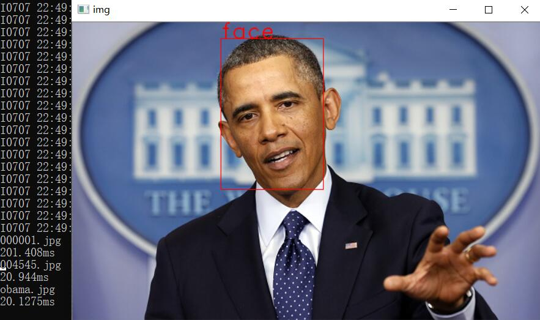

# ssd-face 轻量级SSD人脸检测器

## Usage

从[releases](https://github.com/imistyrain/ssd-face/releases)下载预训练好的[模型](https://github.com/imistyrain/ssd-face/releases/download/1.0/MobileNetSSD_face.caffemodel)(21M, 训练120000 iters), 将其置于Face文件夹下.
```
pip install opencv-python==3.4.0.14
python demo.py
```



## 1. 下载并编译[ssd](https://github.com/imistyrain/ssd) 
[原始版本](https://github.com/weiliu89/caffe)仅能在ubuntu下编译通过，这里提供一个可以在Windows、Linux和MAC都能编译的版本，并且添加了可分离卷积层的实现.

```
git clone https://github.com/imistyrain/ssd
mkdir build
cd build
make -j8
```
为方便起见，后文将下载的ssd所在文件夹记为$SSD_ROOT

## 2. 下载并编译本项目
本项目使用CMake进行跨平台编译并且需要OpenCV版本为3.3及以上,或者3.0以上自己编译带有dnn支持的库

```
git clone https://github.com/imistyrain/ssd-face
cd ssd-face
./demo.sh
```

Note: 如果遇到找不到mropencv.h等文件, 可参考opencv跨平台自动化配置[MRHead](https://github.com/imistyrain/MRHead)

如果正在使用opencv3.3及以上版本，其自带了dnn支持, 如果是3.2及以下版本，则需要外加opencv_extra重新编译opencv,(注意勾选WITH_DNN)

## 3. 训练自己的数据

### 3.1 准备训练数据，将数据转换为VOC格式

如果想直接训练fddb的话，可以直接下载已经转换好的[fddb库](http://pan.baidu.com/s/1pK8jglP)(百度网盘， 密码：g33x，约102M)，并将其置于~/data/Face2017下，这个步骤过程可以参见[将fddb标注转换为VOC格式标注](http://blog.csdn.net/minstyrain/article/details/77938596)

当然，你也可以换成自己的数据，推荐一个好用的标注工具:[MRLabeler](https://github.com/imistyrain/MRLabeler)

### 3.2 生成训练所需格式数据

```
python create_lmdb.py
```
原始ssd需要将数据放到指定目录并且要运行两个脚本，其对文件位置有这严苛的要求，稍有不慎就会弄错.本项目根据其中的内容提取成了create_list.py文件，其包含两个函数，create_list把训练图片路径及其标注按行写入到trainval.txt中，把测试图片路径及其标注按行写入到test.txt中，把测试图片路径及其大小（高度、宽度）写入到test_name_size.txt中

```
Note:由于fddb中含有多级目录,为了兼容SSD及YOLO的训练结构要求,此脚本将路径中的"/"转换为了"_"
```

create_data用于生成训练所需的lmdb文件,由于要支持多标签的输入，因此其内部使用了slice data layer，避免使用hdf5生成文件过大的问题

### lmdb数据可视化
使用python [convert2lmdb.py](convert2lmdb.py)提供的lmdb2image检查标注的正确性, 也可使用其完成上一步的转换工作.

### 3.3 启动训练

```
./run.sh
```

## FLOPs分析
```
MobileNetSSD_deploy.prototxt
layer name              Filter Shape     Output Size      Params   Flops        Ratio
conv0                   (32, 3, 3, 3)    (1, 32, 150, 150) 864      19440000     1.729%
conv1/dw                (32, 1, 3, 3)    (1, 32, 150, 150) 288      6480000      0.576%
conv1                   (64, 32, 1, 1)   (1, 64, 150, 150) 2048     46080000     4.098%
conv2/dw                (64, 1, 3, 3)    (1, 64, 75, 75)  576      3240000      0.288%
conv2                   (128, 64, 1, 1)  (1, 128, 75, 75) 8192     46080000     4.098%
conv3/dw                (128, 1, 3, 3)   (1, 128, 75, 75) 1152     6480000      0.576%
conv3                   (128, 128, 1, 1) (1, 128, 75, 75) 16384    92160000     8.196%
conv4/dw                (128, 1, 3, 3)   (1, 128, 38, 38) 1152     1663488      0.148%
conv4                   (256, 128, 1, 1) (1, 256, 38, 38) 32768    47316992     4.208%
conv5/dw                (256, 1, 3, 3)   (1, 256, 38, 38) 2304     3326976      0.296%
conv5                   (256, 256, 1, 1) (1, 256, 38, 38) 65536    94633984     8.416%
conv6/dw                (256, 1, 3, 3)   (1, 256, 19, 19) 2304     831744       0.074%
conv6                   (512, 256, 1, 1) (1, 512, 19, 19) 131072   47316992     4.208%
conv7/dw                (512, 1, 3, 3)   (1, 512, 19, 19) 4608     1663488      0.148%
conv7                   (512, 512, 1, 1) (1, 512, 19, 19) 262144   94633984     8.416%
conv8/dw                (512, 1, 3, 3)   (1, 512, 19, 19) 4608     1663488      0.148%
conv8                   (512, 512, 1, 1) (1, 512, 19, 19) 262144   94633984     8.416%
conv9/dw                (512, 1, 3, 3)   (1, 512, 19, 19) 4608     1663488      0.148%
conv9                   (512, 512, 1, 1) (1, 512, 19, 19) 262144   94633984     8.416%
conv10/dw               (512, 1, 3, 3)   (1, 512, 19, 19) 4608     1663488      0.148%
conv10                  (512, 512, 1, 1) (1, 512, 19, 19) 262144   94633984     8.416%
conv11/dw               (512, 1, 3, 3)   (1, 512, 19, 19) 4608     1663488      0.148%
conv11                  (512, 512, 1, 1) (1, 512, 19, 19) 262144   94633984     8.416%
conv12/dw               (512, 1, 3, 3)   (1, 512, 10, 10) 4608     460800       0.041%
conv12                  (1024, 512, 1, 1) (1, 1024, 10, 10) 524288   52428800     4.663%
conv13/dw               (1024, 1, 3, 3)  (1, 1024, 10, 10) 9216     921600       0.082%
conv13                  (1024, 1024, 1, 1) (1, 1024, 10, 10) 1048576  104857600    9.326%
conv14_1                (256, 1024, 1, 1) (1, 256, 10, 10) 262144   26214400     2.331%
conv14_2                (512, 256, 3, 3) (1, 512, 5, 5)   1179648  29491200     2.623%
conv15_1                (128, 512, 1, 1) (1, 128, 5, 5)   65536    1638400      0.146%
conv15_2                (256, 128, 3, 3) (1, 256, 3, 3)   294912   2654208      0.236%
conv16_1                (128, 256, 1, 1) (1, 128, 3, 3)   32768    294912       0.026%
conv16_2                (256, 128, 3, 3) (1, 256, 2, 2)   294912   1179648      0.105%
conv17_1                (64, 256, 1, 1)  (1, 64, 2, 2)    16384    65536        0.006%
conv17_2                (128, 64, 3, 3)  (1, 128, 1, 1)   73728    73728        0.007%
conv11_mbox_loc         (12, 512, 1, 1)  (1, 12, 19, 19)  6144     2217984      0.197%
conv11_mbox_conf_new    (6, 512, 1, 1)   (1, 6, 19, 19)   3072     1108992      0.099%
conv13_mbox_loc         (24, 1024, 1, 1) (1, 24, 10, 10)  24576    2457600      0.219%
conv13_mbox_conf_new    (12, 1024, 1, 1) (1, 12, 10, 10)  12288    1228800      0.109%
conv14_2_mbox_loc       (24, 512, 1, 1)  (1, 24, 5, 5)    12288    307200       0.027%
conv14_2_mbox_conf_new  (12, 512, 1, 1)  (1, 12, 5, 5)    6144     153600       0.014%
conv15_2_mbox_loc       (24, 256, 1, 1)  (1, 24, 3, 3)    6144     55296        0.005%
conv15_2_mbox_conf_new  (12, 256, 1, 1)  (1, 12, 3, 3)    3072     27648        0.002%
conv16_2_mbox_loc       (24, 256, 1, 1)  (1, 24, 2, 2)    6144     24576        0.002%
conv16_2_mbox_conf_new  (12, 256, 1, 1)  (1, 12, 2, 2)    3072     12288        0.001%
conv17_2_mbox_loc       (24, 128, 1, 1)  (1, 24, 1, 1)    3072     3072         0.0%
conv17_2_mbox_conf_new  (12, 128, 1, 1)  (1, 12, 1, 1)    1536     1536         0.0%
Layers num: 47
Total number of parameters:  5492672
Total number of FLOPs:  1124416960
```

## vgg_ssd: 不推荐，模型大且慢，不实用

```
python ssd_train.py
python ssd_test.py
```
the trained model is about 90M.

## 参考

* [人脸检测最佳实践](https://blog.csdn.net/minstyrain/article/details/104870285)

* [yolo-face](https://github.com/imistyrain/yolo-face)